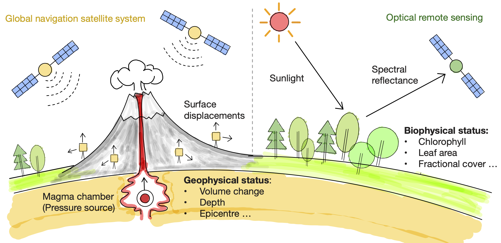
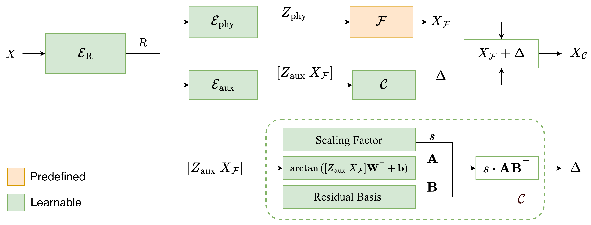

# PILA: Physics-Informed Low-Rank Augmentation for Interpretable Earth Observation

[](https://opensource.org/licenses/MIT)
[](https://www.python.org/downloads/)

Keywords: physics-informed machine learning, inverse problems, incomplete physical models, low-rank augmentation, Earth observation

This repository contains the code for PILA as described in:
https://arxiv.org/abs/2405.18953 

PILA stands for **Physics-Informed Low-Rank Augmentation**. It augments a forward physics model with a low-rank, learnable refinement to address model incompleteness during inversion. 


*We study inverse problems arising from Earth observations of disparate physical processes, to understand the planet, from the surface to the subsurface. Study cases include: the inversion of a forest radiative transfer model---a planet renderer---to estimate biophysical status; and the inversion of a volcanic deformation model---representative of a broad family of geophysical inverse problems---to infer subsurface geophysical activity.*


*PILA inverts physical models of varying incompleteness using a residual of intrinsically low rank. Given an observation X, E_R maps it to a high-dimensional feature R, which is then encoded by E_phy and E_aux into physical variables Z_phy and auxiliary variables Z_aux. Z_phy is decoded by F to produce a physical reconstruction X_F, which is refined by a low-rank residual Δ to yield the final reconstruction X_C. The residual Δ is computed by a mapping C as the product of a scaling factor s, a coefficient matrix A in R^{n x r}, and a residual basis matrix B in R^{d x r}, with rank(Δ) = r << d. Here, s and B are shared parameters applied to all samples, while A is obtained by linearly mapping the concatenation of Z_aux and the physical output X_F, with a stop-gradient operation applied to X_F during backpropagation.*

## Key Components

- **PILA (our method)**: `configs/phys_smpl/`, `train_pila.py`,
  `model/model_phys_smpl.py`, `physics/`, `trainer/trainer_phys_smpl.py`

We study two representative EO inverse problems with PILA:
- **Mogi inversion** from space geodesy to monitor volcanic activities (GNSS-monitored surface displacements from Akutan Volcano)
- **RTM inversion** from optical remote sensing to understand forest dynamics (Sentinel-2 spectra from Austrian forest, and Wytham Wood, UK)

## Environment

```bash
./setup_environment.sh
```

Or manually:

```bash
conda env create -f environment.yml
conda activate pila
```

## Training

PILA (our method):

```bash
python train_pila.py --config configs/phys_smpl/PILA_Mogi_C.json
python train_pila.py --config configs/phys_smpl/PILA_RTM_C_austria.json
python train_pila.py --config configs/phys_smpl/PILA_RTM_C_wytham.json
```

See `run.sh` for additional examples.

## Evaluation

```bash
python test_pila_mogi.py \
  --config saved/mogi/EXPERIMENT_NAME/MMDD_HHMMSS/models/config.json \
  --resume saved/mogi/EXPERIMENT_NAME/MMDD_HHMMSS/models/model_best.pth

python test_pila_rtm.py \
  --config saved/rtm/EXPERIMENT_NAME/MMDD_HHMMSS/models/config.json \
  --resume saved/rtm/EXPERIMENT_NAME/MMDD_HHMMSS/models/model_best.pth \
  --insitu
```

Equivalent HVAE commands are available in `run.sh`.

## Baseline (HVAE)

HVAE stands for **Hybrid Auto-Encoder** and is used as a baseline for
comparison. For details, see Takeishi and Kalousis (2021):
https://proceedings.neurips.cc/paper_files/paper/2021/file/7ca57a9f85a19a6e4b9a248c1daca185-Paper.pdf

To reproduce the baseline:

```bash
python train_hvae.py --config configs/phys/HVAE_Mogi_C.json
python train_hvae.py --config configs/phys/HVAE_RTM_C_austria.json
python train_hvae.py --config configs/phys/HVAE_RTM_C_wytham.json
```

## Configs and Variants

Configs follow the A/B/C variants:
- **A**: no physics (`no_phy: true`)
- **B**: physics only (`dim_z_aux: 0`)
- **C**: physics + refinement (PILA residual)

PILA configs live in `configs/phys_smpl/`. HVAE configs live in `configs/phys/`.

## Project Structure

```
PILA/
├── base/                 # Base classes
├── configs/              # Experiment configs
│   ├── phys/             # HVAE configs
│   └── phys_smpl/        # PILA configs
├── data/                 # Data (see notes below)
├── data_loader/          # Data loaders
├── datasets/             # Dataset preprocessing utilities
├── figures/              # Figures used in README/paper
├── model/                # PILA/HVAE models, losses, metrics
├── physics/              # Forward physics models (RTM, Mogi)
├── pretrained/           # Pretrained checkpoints (to be updated)
├── trainer/              # PILA/HVAE trainers
├── utils/                # Utilities
└── run.sh                # Example commands
```

## Data and Checkpoints

- `data/` will be updated to include all datasets used in the paper.
- Pretrained checkpoints will be added; key models will be shared via an
  external link (to be provided).

## Adding a New Physics Model

1. Implement the forward model under `physics/your_model/`.
2. Add a new config under `configs/phys_smpl/` (PILA).
3. Update/extend the data loader if your input format changes.
4. Train with `train_pila.py` or `train_hvae.py`.

## Citation

```bibtex
@misc{she2025pilaphysicsinformedlowrank,
      title={PILA: Physics-Informed Low Rank Augmentation for Interpretable Earth Observation},
      author={Yihang She and Andrew Blake and Clement Atzberger and Adriano Gualandi and Srinivasan Keshav},
      year={2025},
      eprint={2405.18953},
      archivePrefix={arXiv},
      primaryClass={cs.LG},
      url={https://arxiv.org/abs/2405.18953},
}
```
